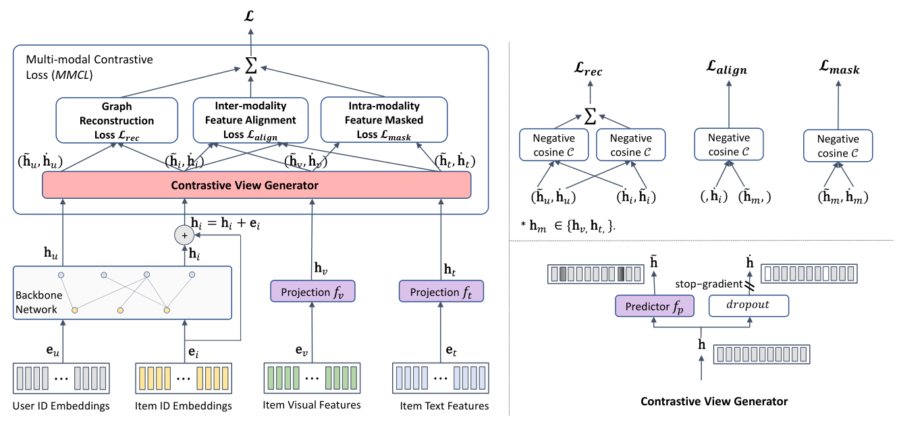

# BM3 (WWW'23)
Pytorch implementation for "Bootstrap Latent Representations for Multi-modal Recommendation"-WWW'23 [Official ACM](https://dl.acm.org/doi/10.1145/3543507.3583251)
- Trained logs&models are stored at: https://github.com/enoche/BM3/tree/master/trained-models-logs
- :twisted_rightwards_arrows: This model is integrated into the [MMRec](https://github.com/enoche/MMRec) framework.
- :point_right: Check the awesome [multimodal recommendation resources](https://github.com/enoche/MultimodalRecSys).

## Overview of BM3
<p>

</p>

## Data  
Download from Google Drive: [Baby/Sports/Elec](https://drive.google.com/drive/folders/13cBy1EA_saTUuXxVllKgtfci2A09jyaG?usp=sharing)  
The data already contains text and image features extracted from Sentence-Transformers and CNN.  

## How to run
1. Put your downloaded data (e.g. `baby`) under `data` dir.
2. Enter `src` folder and run with  
`python main.py -m BM3 -d baby`  
You may specify other parameters in CMD or config with `configs/model/*.yaml` and `configs/dataset/*.yaml`.

## Best hyper-parameters for reproducibility
We report the best hyper-parameters of BM3 to reproduce the results in Table III of our paper as:  

| Datasets | layers | dropout | reg_weight |
|----------|--------|---------|------------|
| Baby     | 1      | 0.5     | 0.1        |
| Sports   | 1      | 0.5     | 0.01       |
| Elec     | 2      | 0.3     | 0.1        |


## Citation
```
@inproceedings{zhou2023bootstrap,
author = {Zhou, Xin and Zhou, Hongyu and Liu, Yong and Zeng, Zhiwei and Miao, Chunyan and Wang, Pengwei and You, Yuan and Jiang, Feijun},
title = {Bootstrap Latent Representations for Multi-Modal Recommendation},
booktitle = {Proceedings of the ACM Web Conference 2023},
pages = {845–854},
year = {2023}
}
```
